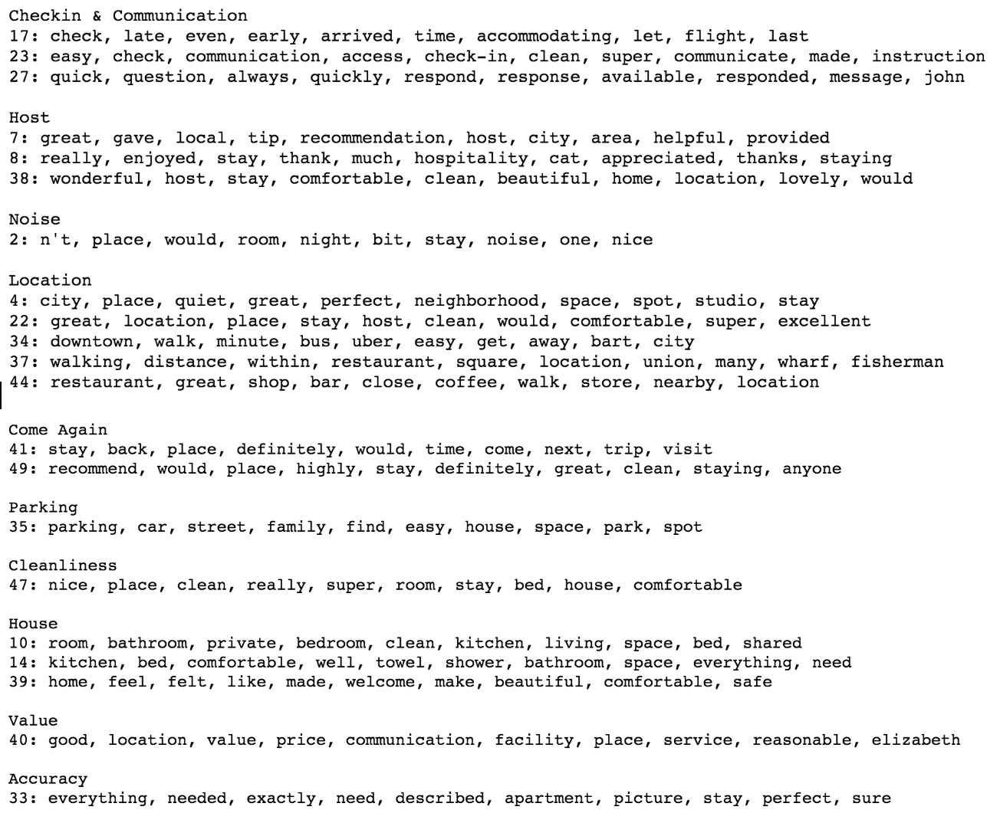
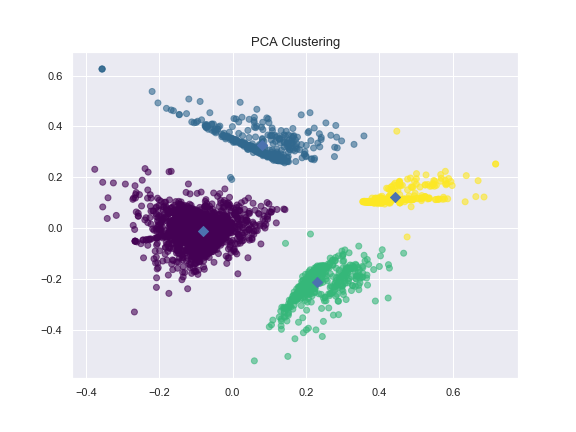

# Airbnb_Review_Topic_Modeling

## Full Report: 
https://github.com/daikiminaki/Capstone_2_Airbnb_Review_Topic_Modeling/blob/master/Capstone_2_Airbnb_Review_Topic_Modeling_Report.pdf

## Objective
Identify topics in Airbnb reviews and use the categorizations to analyze and build models to gain insights on reviews, reviewers, hosts, and listings.

## Data
The data used in this project was pulled from InsideAirbnb and consists of reviews, and listing data from around the world.  For the sake of time and resources I decided to focus only on listings in San Francisco which still looked at over 300,000 reviews.

## Approach
The goal is to use Latent Dirichlet Allocation and K-Means Clustering to first find out what reviewers are writing about, group listings by review content and then understand the differences in how reviewers review listings.

## Data Cleaning and Wrangling
The data cleaning process consisted of preparing the review text data for processing.  This like most NLP work involves removing stopwords from the text, lemmatizing, removing misc characters, and other techniques.  

## Latent Dirichlet Allocation
After cleaning the text data came the LDA.  I decided to set the parameters for the LDA to 10 words per topic, 50 topics total, and 50 passes of the data.  Even with only 300,000 reviews the process took over 9 hours which made it difficult to run a high number of iterations with parameters.  However, even with minimal runs I was able to end up with a list of topics that worked for the project shown below:

## KMeans Clustering
Now that the topics were identified for the reviews it was possible to look at trends and behaviors of reviews more systematically.  The main point of interest for this project was to find trends of users BY LISTING so I decided to summarize the topics by listing.  I then used the topic data to cluster listings to find groups of listing review behavior. Shown Below:

## Results
Using Latent Dirichlet Allocation (LDA) I was able to successfully pull different topics from review data and use these topics to gain insight on how guests review listings on Airbnb.  To get a sense of some overarching trends in the type of reviews that were left for different listings I performed K-Means clustering which clustered the listings into four main groups. 

The key differences in the review behavior for the four clusters mainly dealt with whether “Cleanliness” and “Come Again” were mentioned in the reviews of the listings or not.  Using this I also did some analysis to see what the reason could be for the difference and whether there were any interesting relationships between listing features and the mention of the different topics.  In the end it seems like there is a clear relationship between reviewers leaving “Come Back” reviews and a listing with high ratings and listings with lower prices with more mentions of cleanliness.

### Slide Deck: 
https://github.com/daikiminaki/Capstone_2_Airbnb_Review_Topic_Modeling/blob/master/Capstone_2_Airbnb_Review_Topic_Modeling_Presentation.pdf

### Report: 
https://github.com/daikiminaki/Capstone_2_Airbnb_Review_Topic_Modeling/blob/master/Capstone_2_Airbnb_Review_Topic_Modeling_Report.pdf
